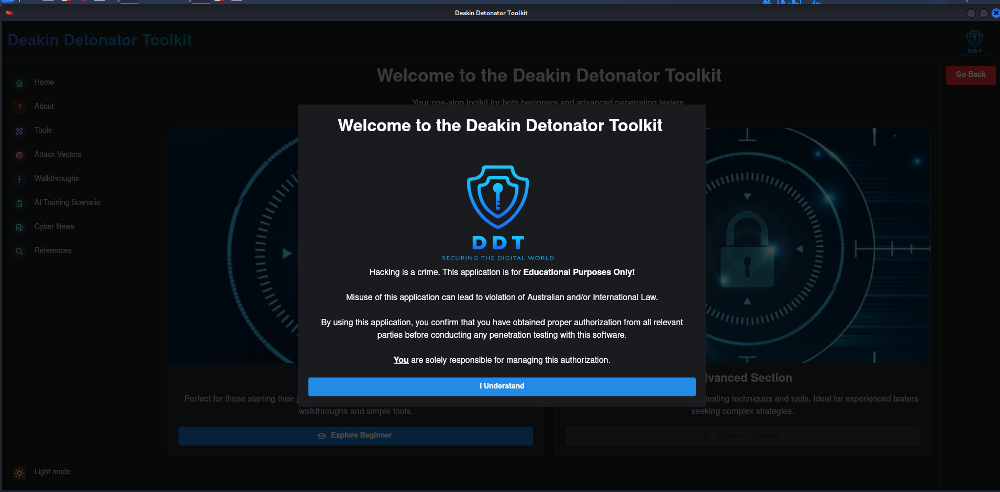

# 🧰 Deakin Detonator Toolkit

The Deakin Detonator Toolkit (DDT) is a desktop penetration-testing toolkit developed by Hardhat Enterprises at Deakin University.

DDT provides a graphical interface for many commonly used command-line security tools. It allows users to configure and execute supported tools without needing to manually construct each command.

- UI built with [Mantine](https://mantine.dev), [ReactJS](https://reactjs.org/), [TypeScript](https://www.typescriptlang.org/).
- Shipped as desktop client via [Tauri 2](https://tauri.app/), [Rust](https://rust-lang.org/).
- GUI exhibition will be available here: http://34.129.77.178:8080 (Deakin Intranet Only)

`src/` contains the source code for the UI.
`src-tauri` contains the source code and configuration for the Tauri application.

## 📚 Documentation

- [User Guide](DDT-User-Guide.pdf)
- [Technology Stack](docs/TECHNOLOGY.md)
- [Contributing Guide](CONTRIBUTING.md)
- [Exploit Development](docs/EXPLOIT.md)
- [Security Policy](SECURITY.md)
- [Supported Tools](docs/TOOLS.md)
- [Tool Guides](The%20Tool%20Guides/)

## 🚀 Quick Start

DDT is primarily developed and tested on Kali Linux.

### System Minimum Requirements

- Kali 2024.1 or later
- 4GB RAM
- 2 CPU cores
- Internet connection

### Install and Launch

The recommended installation method uses the included DDT setup script.

```bash
curl -sSL https://raw.githubusercontent.com/Hardhat-Enterprises/Deakin-Detonator-Toolkit/main/install-update-media/setup_ddt.sh -o setup_ddt.sh && chmod +x setup_ddt.sh && ./setup_ddt.sh
```

Application can be launched from within the "Deakin-Detonator-Toolkit" directory using:

```bash
WEBKIT_DISABLE_DMABUF_RENDERER=1 WEBKIT_DISABLE_COMPOSITING_MODE=1 corepack yarn tauri dev
```

## 🖼️ Application Preview

After DDT launches successfully, the application should resemble the following:



## 🧑‍🍳 Contributing

For development environment setup and pull request requirements see [Contributing Guide](CONTRIBUTING.md).

## 📦 Release

For release and update procedures see [Release Guide](docs/RELEASE.md)

## 📜 Old Installation Guide

For the previouse installation method see [Old Installation Guide](docs/OLD_INSTALLATION_GUIDE.md)
