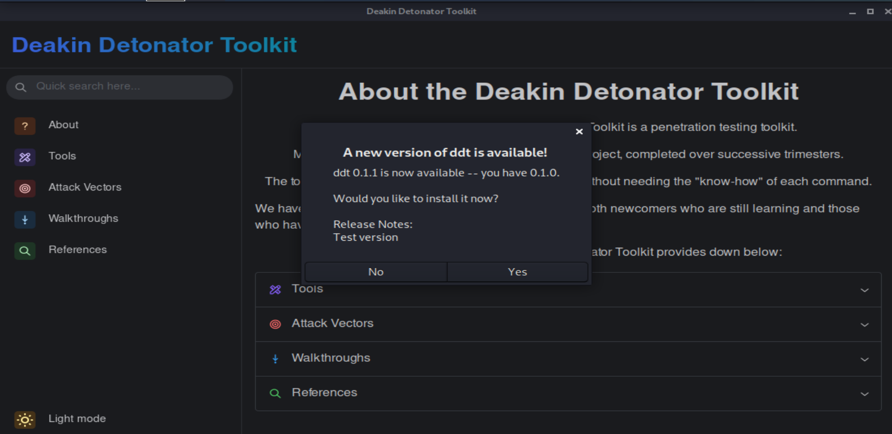

# Release

1. Change the version number in src-tauri/tauri.conf.json larger than current version

2. Merge the main branch into release branch, it will trigger the CD pipeline to update the repo release info

3. The update information will appear when user open the app

[Back](../README.md)
